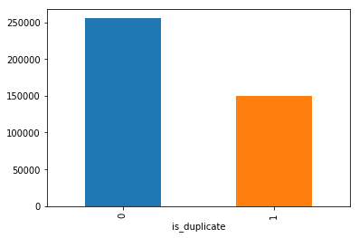
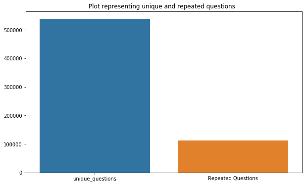
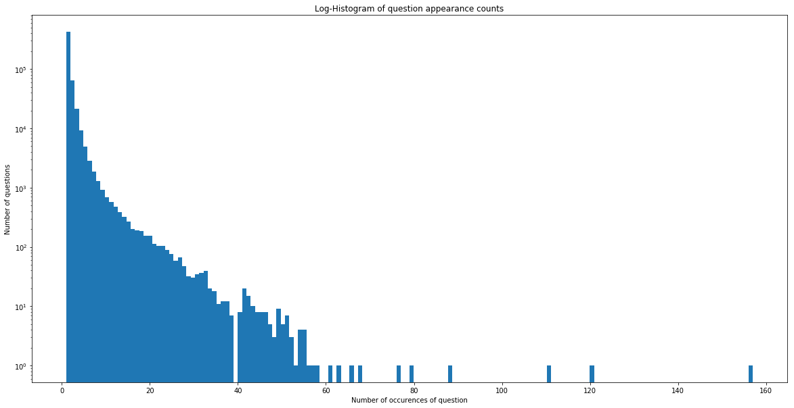
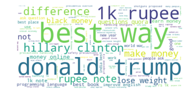
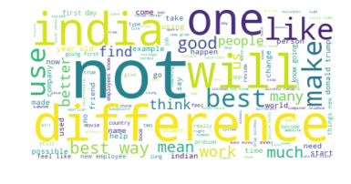
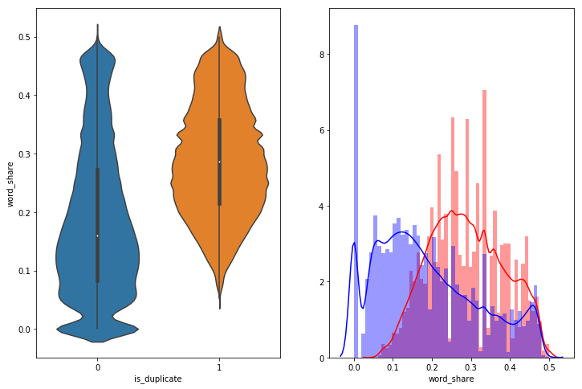
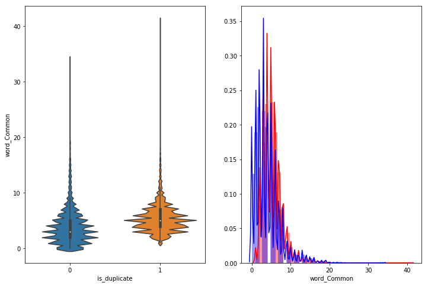
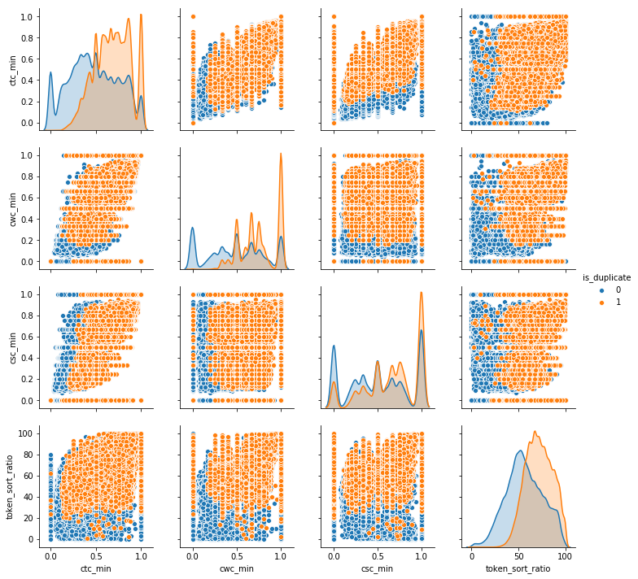

# Quora Question Pair Similarity

we all know quora is a place where we can gain and share knowledge about any thing.It’s a platform to ask questions and connect with people who contribute unique insights and quality answers. This empowers people to learn from each other and to better understand the world.

Over 100 million people visit Quora every month, so it's no surprise that many people ask similarly worded questions. Multiple questions with the same intent can cause seekers to spend more time finding the best answer to their question, and make writers feel they need to answer multiple versions of the same question. Quora values canonical questions because they provide a better experience to active seekers and writers, and offer more value to both of these groups in the long term.

<h3>Problem Statement: </h3>

Identify which questions asked on Quora are duplicates of questions that have already been asked.

<h3>1.3 Real world/Business Objectives and Constraints</h3>
<ul>
  <li> The cost of a mis-classification can be very high.</li>
  <li> You would want a probability of a pair of questions to be duplicates so that you can choose any threshold of choice.</li>
  <li> No strict latency concerns.</li>
  <li> Interpretability is partially important.</li>
</ul>
<h3> Performance Metrics </h3>
<ul>
  <li> log-loss </li>
  <li> Binary Confusion Matrix </li>
</ul>
<h3> Data OverView and Exploratory Data Analysis </h3>
<ul>
  <li> Data will be in a file Train.csv </li>
  <li> Train.csv contains 5 columns : qid1, qid2, question1, question2, is_duplicate </li>
  <li> Number of rows in Train.csv = 404,290 </li>
</ul>
<h3> Some Analysis: </h3>
<ul>
  <li> Distribution of data points among output classes. </li>
  </img>
  <li> Number of Unique Questions. </li>
  </img>
  <li> Number of occurences of each question </li>
  </img>
  <li> Word cloud for similar questions </li>
  </img>
  <li> Word cloud for non similar questions </li>
  </img>
</ul>
<h3> Feature Extraction </h3>
<h4> Basic Feature Extraction(before cleaning data) </h4>
<ul>
  <li> freq_qid1 = Frequency of qid1's </li>
  <li> freq_qid2 = Frequency of qid2's </li>
  <li> q1len = Length of q1            </li>
  <li> q2len = Length of q2            </li>
  <li> q1_n_words = Number of words in Question 1 </li>
  <li> q2_n_words = Number of words in Question 2 </li>
  <li> word_Common = (Number of common unique words in Question 1 and Question 2) </li>
  <li> word_Total =(Total num of words in Question 1 + Total num of words in Question 2) </li>
  <li> word_share = (word_common)/(word_Total) </li>
  <li> freq_q1+freq_q2 = sum total of frequency of qid1 and qid2 </li>
  <li> freq_q1-freq_q2 = absolute difference of frequency of qid1 and qid2 </li>
</ul>
<h4> Adavnced Features (NLP and Fuzzy Features) </h4>

before that performed stop word removal,stemming

<ul>
  <li> Token: You get a token by splitting sentence a space </li>
  <li> Stop_Word : stop words as per NLTK.</li>
  <li> Word : A token that is not a stop_word.</li>
</ul>
<ul>
  <li> cwc_min : Ratio of common_word_count to min lenghth of word count of Q1 and Q2
    cwc_min = common_word_count / (min(len(q1_words), len(q2_words)) </li>
  <li> cwc_max : Ratio of common_word_count to max lenghth of word count of Q1 and Q2
    cwc_max = common_word_count / (max(len(q1_words), len(q2_words)) </li>
  <li> csc_min : Ratio of common_stop_count to min lenghth of stop count of Q1 and Q2
    csc_min = common_stop_count / (min(len(q1_stops), len(q2_stops)) </li>
  <li> csc_max : Ratio of common_stop_count to max lenghth of stop count of Q1 and Q2
    csc_max = common_stop_count / (max(len(q1_stops), len(q2_stops)) </li>
  <li> ctc_min : Ratio of common_token_count to min lenghth of token count of Q1 and Q2
    ctc_min = common_token_count / (min(len(q1_tokens), len(q2_tokens)) </li>
  <li> ctc_max : Ratio of common_token_count to max lenghth of token count of Q1 and Q2
ctc_max = common_token_count / (max(len(q1_tokens), len(q2_tokens)) </li>
  <li> last_word_eq : Check if First word of both questions is equal or not
    last_word_eq = int(q1_tokens[-1] == q2_tokens[-1]) </li>
  <li> first_word_eq : Check if First word of both questions is equal or not
    first_word_eq = int(q1_tokens[0] == q2_tokens[0]). </li>
  <li> abs_len_diff : Abs. length difference
    abs_len_diff = abs(len(q1_tokens) - len(q2_tokens)). </li>
  <li> mean_len : Average Token Length of both Questions
    mean_len = (len(q1_tokens) + len(q2_tokens))/2. </li>
  <li> fuzz_ratio : How much percentage these two strings are similar, measured with edit distance. </li>
  <li> fuzz_partial_ratio = if two strings are of noticeably different lengths, we are getting the score of the best matching lowest length substring. </li>
  <li> token_sort_ratio = sorting the tokens in string and then scoring fuzz_ratio. </li>
  <li> longest_substr_ratio = len(longest common substring) / (min(len(q1_tokens), len(q2_tokens)). </li>
</ul>
<h4> Some Features analysis and visualization .</h4>
<ul>
  <li> word_share - We can check from below that it is overlaping a bit, but it is giving some classifiable score for disimilar questions.</li>
  </img>
  <li> Word Common - it is almost overlaping. </li>
  </img>
  <li> Bivariate analysis of features 'ctc_min', 'cwc_min', 'csc_min', 'token_sort_ratio'. We can observe that we can divide duplicate and non duplicate with some of these features with some patterns. </li>
  </img>
<h3>Machine Learning Models </h3>
<ul>
  <li> i took only 200k data points only because it is taking huge amount of time. </li>
  <li> Trained a Random Model and got log loss as 0.87 </li>
  <li> Trained an SGD with log loss(i.e logistic regression) and got log loss of 0.44. </li>
  <li> Trained and SGD with hinge loss and got log loss of 0.48. </li>
  <li> Trained XG Boost and got log loss of 0.33 </li>
</ul>
<table>
  <tr>
    <th> Model </th>
    <th> Features </th>
    <th> Score </th>
  </tr>
  <tr>
    <td> SGD with log loss </td>
    <td> Advanced and Basic Features </td>
    <td> 0.44 </td>
  </tr>
  <tr> 
    <td> SGD with hinge loss </td>
    <td> Advanced and Basic Features </td>
    <td> 0.48 </td>
 </tr>
  <tr>
    <td> XGBoost  </td>
    <td> Advanced and Basic Features </td>
    <td> 0.33 </td>
  </tr>
</table>
<h4>CREDITS</h4>
  
    
    

 

  
